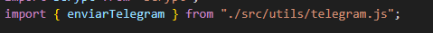
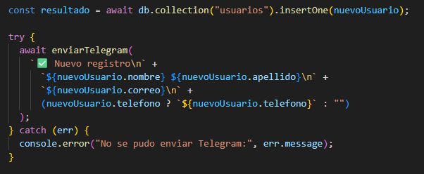

# Move & Lite — API + Front (Registro/Login)

Proyecto con **frontend en Vue** (registro/login) y **backend en Node/Express** conectado a **MongoDB Atlas**.  
Cuando un usuario se registra, el backend también envía una **notificación por Telegram**.

---

## 📌 Tecnologías

**Backend**
- Node.js + Express
- MongoDB Atlas (driver oficial `mongodb`)
- bcrypt (hash de contraseñas)
- CORS
- dotenv
- Inngest (endpoint `/api/inngest`)
- Telegram (notificación al registrar)

**Frontend**
- Vue 3 
- Fetch API

---

## 📷 Capturas

> Acá pegá tus imágenes

- Pantalla de registro: `./docs/registro.png`
- Pantalla de login: `./docs/login.png`
- Notificación Telegram: `./docs/telegram.png`

---
# Integración con Telegram + API (Move & Lite)

Este proyecto envía una **notificación por Telegram** cuando se registra un usuario nuevo.  
La notificación se envía **desde el backend (Node/Express)**, nunca desde el frontend, para no exponer el token del bot.

---

## 1) Crear un Bot de Telegram (paso a paso)

1. Abrí Telegram y buscá **@BotFather**
2. Escribí: /newbot
3. BotFather te va a pedir:
- **Nombre** del bot (ej: `MoveLite Bot`)
- **Usuario** del bot (debe terminar en `bot`, ej: `movelite_notifier_bot`)
4. BotFather te entrega un **TOKEN** 
 Guardá ese token, lo vas a usar en el `.env` como `TELEGRAM_BOT_TOKEN`.

## 2) Obtener el CHAT_ID (a dónde llega el mensaje)

### Opción A: Mensaje a un chat personal
1. Abrí tu bot y tocá **Start**
2. Enviá cualquier mensaje al bot (ej: "hola")
3. Abrí en el navegador:
4. En la respuesta buscá algo como:
- `"chat":{"id": 123456789, ... }`

Ese número es tu `TELEGRAM_CHAT_ID`.

- **POST** `/usuarios`

La notificación **NO se envía desde el frontend** (Vue).  
El frontend solo hace un `fetch` al backend, y **el backend** es quien manda el mensaje a Telegram.

---

##  ¿Como enviar el mensaje?
### Estuctura carpetas

### Codigo que recoge los datos que envia el mensaje

### Estuctura para coger token chat id

