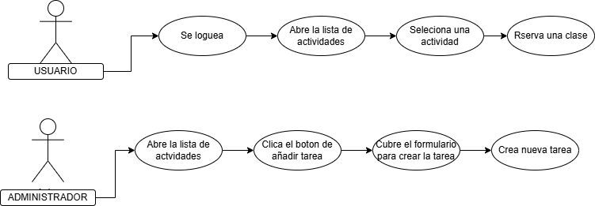

# Move & Lite — API + Front 

Proyecto con **frontend en Vue**  y **backend en Node/Express** conectado a **MongoDB Atlas**.  
Cuando un usuario se registra, el backend también envía una **notificación por Telegram**.

---

## Tecnologías

**Backend**
- Node.js + Express
- MongoDB Atlas
- bcrypt (hash de contraseñas)
- CORS
- dotenv
- Telegram (notificación al registrar)

**Frontend**
- Vue
- Fetch API

# Integración con Telegram + API

Este proyecto envía una **notificación por Telegram** cuando se registra un usuario nuevo.  
La notificación se envía **desde el backend (Node/Express)**, nunca desde el frontend, para no exponer el token del bot.

## 1) Crear un Bot de Telegram 

1. Abre Telegram y buscá **@BotFather**
2. Escribe: /newbot
3. BotFather te va a pedir:
- **Nombre** del bot (ej: `MoveLite Bot`)
- **Usuario** del bot (debe terminar en `bot`, ej: `movelite_notifier_bot`)
4. BotFather te entrega un **TOKEN** 
 Guarda ese token, lo vas a usar en el `.env` como `TELEGRAM_BOT_TOKEN`.

## 2) Obtener el CHAT_ID

### Opción A: Mensaje a un chat personal
1. Abre tu bot y toca **Start**
2. Envia cualquier mensaje al bot (ej: "hola")
3. Abre en el navegador:
4. En la respuesta busca algo como:
- `"chat":{"id": 123456789, ... }`

Ese numero es tu `TELEGRAM_CHAT_ID`.

- **POST** `/usuarios`

La notificación **NO se envía desde el frontend** (Vue).  
El frontend solo hace un `fetch` al backend, y **el backend** es quien manda el mensaje a Telegram.

---

##  ¿Como enviar el mensaje?
### Estuctura carpetas

### Codigo que recoge los datos que envia el mensaje

### Estuctura para coger token chat id

## Roles

### Usuario
- Registrarse e iniciar sesión
- Explorar las actividades disponibles
- Realizar y cancelar reservas
- Consultar su historial de reservas
- Editar su contraseña

### Administrador
- Crear, editar y eliminar actividades
- Consultar todas las reservas del sistema
- Consultar los usuarios

## Características destacadas
- Autenticación con JWT: sistema de login seguro con tokens, refresh tokens y expiración de sesión.
- Separación de validaciones en backend: validaciones de negocio separadas de las validaciones de entrada de datos.
- Roles y permisos: control de acceso basado en roles.
- Multiplataforma: una misma API sirve tanto al cliente de escritorio como al móvil.
- Sincronización en tiempo real: las reservas se actualizan de forma reactiva en la interfaz.
- Base de datos en la nube: uso de MongoDB Atlas para persistencia de datos sin necesidad de infraestructura local.

## Diagramas de ejemplo de casos de uso de la app

