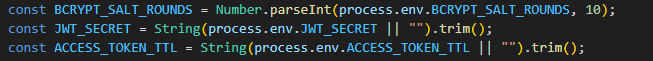
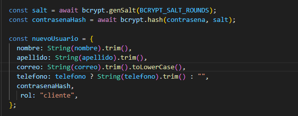
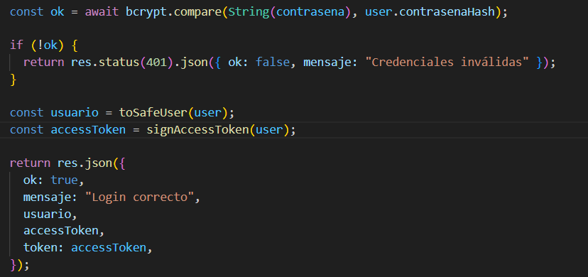
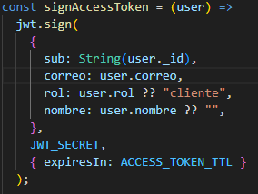

# Auth con JWT (Login / Registro) — Node.js + Express

Este proyecto implementa autenticación usando:

- **bcrypt** para hashear contraseñas .
- **JWT (JSON Web Token)** para manejar sesiones mediante un access token.

## Instalación:

```
npm install express bcrypt jsonwebtoken dotenv
```

---

## Variables de Entorno

Crear un archivo `.env`

### Estuctura para coger token chat id
```env
BCRYPT_SALT_ROUNDS=10
JWT_SECRET=tu_secreto_super_seguro
ACCESS_TOKEN_TTL=1d
```
### Explicación

- **BCRYPT_SALT_ROUNDS** → Nivel de seguridad del hash .
- **JWT_SECRET** → Clave secreta para firmar el token.
- **ACCESS_TOKEN_TTL** → Tiempo de vida del token.

Lectura en el código:



---

# Registro de Usuario con bcrypt

Durante el registro:

1. Se genera un salt.
2. Se hashea la contraseña.
3. Se guarda el usuario con `contrasenaHash`.





# Login de Usuario y Generación del Access Token

Durante el login:

1. Se busca el usuario por correo.
2. Se compara la contraseña ingresada con el hash guardado.


3.Si la contraseña es correcta se gnera el token


La función `toSafeUser()` elimina datos sensibles como `contrasenaHash` antes de enviar el usuario al cliente.

---
