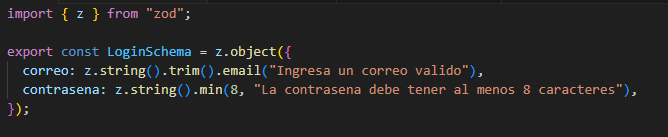
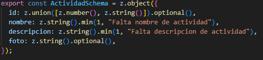
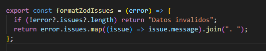
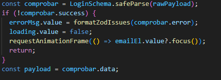
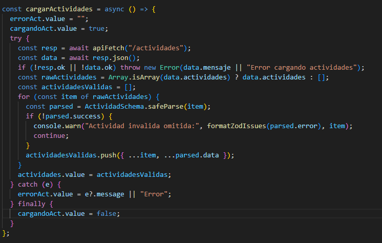

# Validaciones con Zod y Manejo Seguro de Datos

Este módulo implementa validaciones en el frontend usando **Zod** para:

- Validar datos de login
- Validar estructura de actividades
- Formatear errores de validación
---

## LoginSchema

Valida los datos enviados en el login:

- `correo` debe ser un email válido.
- `contrasena` debe tener mínimo 8 caracteres.

---

## ActividadSchema

Valida cada actividad recibida del backend:

- `id` puede ser número o string (opcional).
- `nombre` es obligatorio.
- `descripcion` es obligatoria.
- `foto` es opcional.

---

# Formateo de Errores

Se crea una función para convertir los errores de Zod en mensajes legibles.

Esta función:

- Verifica si existen errores.
- Extrae los mensajes.
- Los une en un solo string.

---

# Validación Segura en el Login

Antes de procesar el login, se usa `safeParse` para validar el payload.

Si la validación falla:

- Se muestra el error.
- Se detiene el flujo.
- Se enfoca el input de email.

Se trabaja únicamente con datos seguros.

---

# Validación de Datos del Backend

Cuando se cargan actividades desde la API:

1. Se obtiene la respuesta.
2. Se valida cada elemento con `ActividadSchema.safeParse`.
3. Las actividades inválidas se omiten.
4. Solo se guardan actividades válidas.

